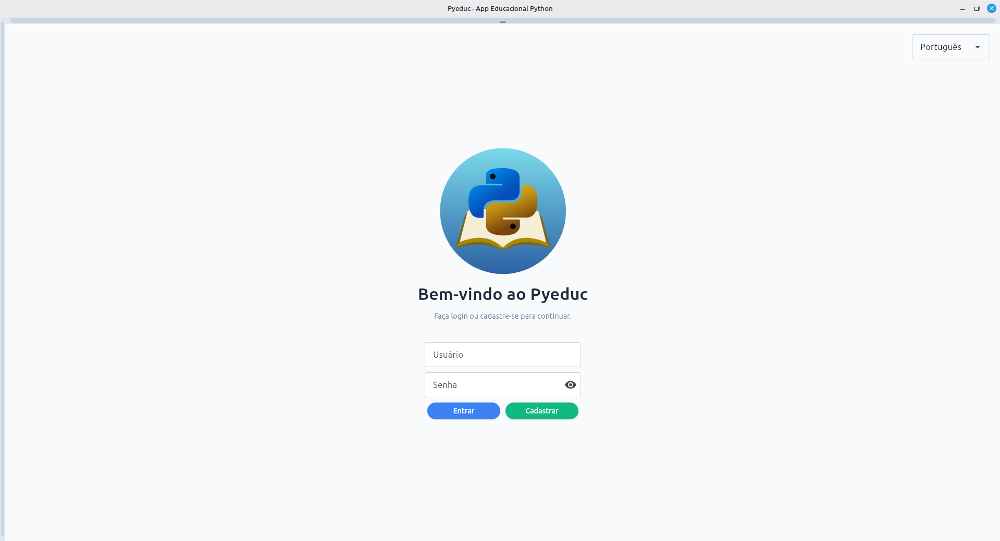
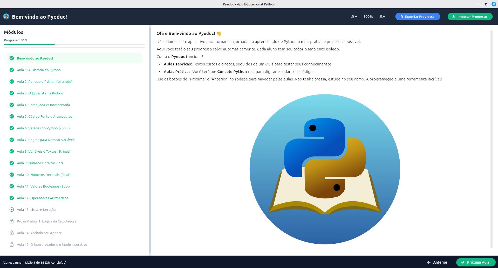
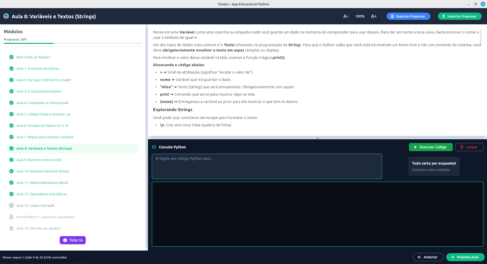
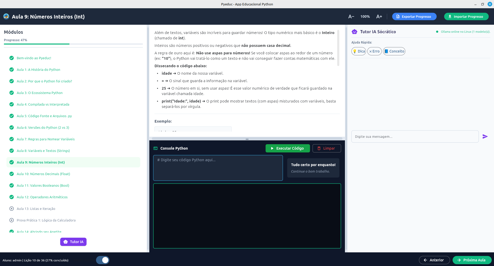

# Manual Básico do Pyeduc

Bem-vindo ao **Pyeduc**! Esta plataforma foi projetada para ensinar os fundamentos da programação Python de forma interativa, mesclando teoria, exercícios práticos (auto-avaliados) e o auxílio de um Tutor IA Inteligente e Socrático.

Abaixo você encontra um guia rápido de como navegar na plataforma e extrair o melhor dos seus recursos.

---

## 1. Iniciando o Pyeduc (Login)

Ao iniciar a aplicação (rodando `python src/main.py`), você será apresentado à tela de Login. 
Você pode usar uma conta pré-existente ou registrar uma nova.

- **Para entrar**: Preencha o "Nome de Usuário" e a "Senha" e clique em **Entrar**.
- **Novo por aqui?**: Basta inserir um nome de usuário que deseja e uma senha, e clicar em **Registrar**.
- **Seletor de Idioma**: No canto superior direito, você pode trocar o idioma do aplicativo antes mesmo de entrar! (Disponível inicialmente em Português e Inglês).
- **Conta de Admin**: Ao entrar com usuário `admin` e senha `admin`, você habilita o "Modo Administrador", permitindo navegar livremente entre todas as aulas, sem bloqueios de progressão sequencial.

---

## 2. Tela de Boas-vindas (Navegação)

Após o login, você será saudado pela tela principal. Aqui você tem um panorama geral das lições disponíveis.

- **Menu Lateral (Esquerdo)**: Mostra todas as aulas. As aulas com cadeado estão bloqueadas até você concluir a aula anterior. As que possuem um visto verde já foram concluídas.
- **Barra de Progresso (Rodapé)**: Indica qual o seu percentual de conclusão do curso.
- **Tipos de Aulas**: Algumas aulas são **Apresentações** (apenas informativas), **Teorias** (com um quiz no final) e **Práticas** (onde você de fato escreverá código). 

---

## 3. Mão na Massa (Console Python)

Nas aulas práticas, você terá uma área dedicada à teoria no topo e uma área de exercícios na parte inferior.

- **Ler a Teoria e Exemplos**: Role a tela para ler o conteúdo. Os blocos de exemplos podem ser copiados rapidamente através do botão "Copiar Exemplo".
- **Área de Código (Editor)**: Na lateral direita, você encontrará o editor de código Python. É aqui que você resolverá os exercícios solicitados.
- **Console de Saída**: O bloco preto abaixo do editor mostrará o resultado exato da execução do seu código (como erros ou os valores que você mandou imprimir com `print()`).
- **Verificação Automática**: Assim que você roda o código (botão **Executar** ou atalho `Ctrl+Enter`), o Pyeduc avalia sua saída. Se a resposta conferir com a esperada, o status do exercício muda para **✅ CONCLUÍDO**.

---

## 4. Pedindo Ajuda (Tutor IA Socrático)

Travou em algum erro de código ou não entendeu uma parte da teoria? O **Tutor IA** está aqui para ajudar!

- **Como acionar**: Nas aulas práticas, clique no botão flutuante **"Abrir Tutor IA"** no canto superior direito para revelar o painel da inteligência artificial.
- **Didática Socrática**: O Tutor é treinado para **não te dar a resposta pronta**! Se você colar um código com erro e perguntar como consertar, ele irá guiá-lo com perguntas e dicas conceituais para que você mesmo descubra o problema, estimulando seu raciocínio lógico.
- **Ações Rápidas**: Na parte inferior do Tutor IA, há botões rápidos ("Me dê uma dica", "Por que tem erro?", "Explique o conceito") para iniciar a conversa facilmente de acordo com o contexto da aula atual.

---

Pronto! Agora você já sabe o essencial para explorar o Pyeduc e aprender a programar Python. Bons estudos e divirta-se codificando!
